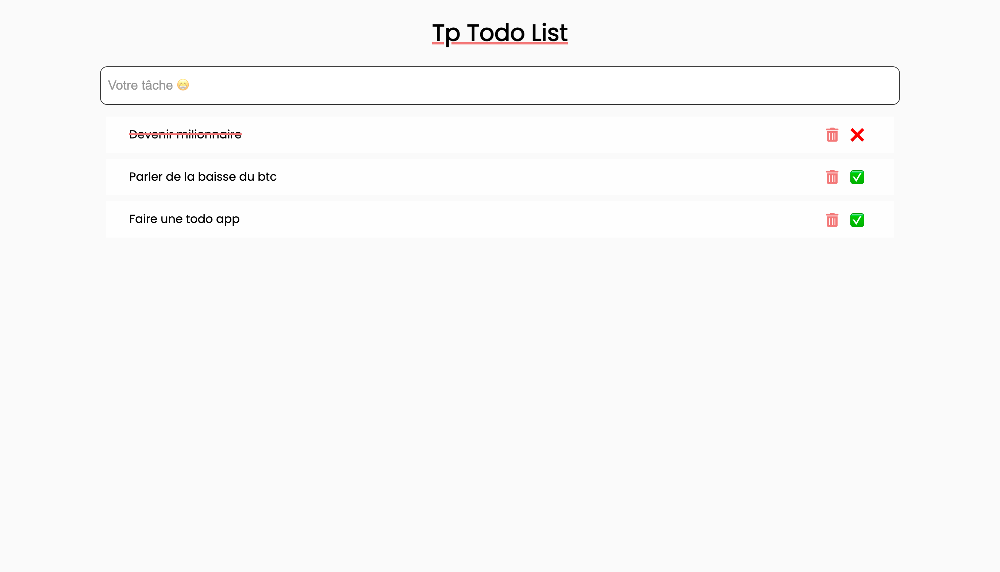

# TP Todo List

Nous allons encore voir des notions JavaScript dans ce tp.

Qu'allons-nous faire ?

Un tp todo list qui va permettre d'enregistrer des informations dans notre liste et cocher pour dire si c'est fait ou pas !

## Etape 1 HTML

Comme à chaque fois, nous allons commencer par l'HTML.. Pourquoi ? Ça va nous permettre de faire le CSS en même temps sans penser à la logique JS.

Pour une bonne application todo list il faut :

- Un input pour taper la tache
- Un bouton pour submit celui-ci (ou autre chose)
- Afficher mes todos
  - Avec comme style quand il est fini
  - ou pas encore (état initial)
- Bouton pour supprimer celui ci


## Etape 2 CSS

Une fois qu'on a la sémantique, et qu'on pense que c'est la bonne, nous allons faire du CSS histoire de toujours manipuler les bases et ne pas perdre ce qu'on a acquis !

ex de ce que j'ai fait :

Une tâche pas finie, et une finie pour tester mon CSS.



Ce que j'ai utilisé : 

- font-family: [Poppins](https://fonts.google.com/specimen/Poppins?query=popp)
- font-awesome pour l'icone: [cdnjs](https://cdnjs.com/libraries/font-awesome) 
- Couleur principal : `#fafafa`
- Couleur secondaire : `#fefefe`
- Couleur rouge : `#f47979`
- Couleur vert : `#79f48b`

Mais n'hésitez pas à faire comme vous le souhaitez ! Ça reste votre TP !

# Etape 3 JavaScript

On commence le JS, alors lui ça va être un bon exercice !

Toujours pareils, nous allons partir de la base pour ensuite faire de plus en plus de chose.

1. Je dois récupérés depuis mon JS tous les éléments du DOM dont j'ai besoin
2. Réfléchir à comment je vais récupérer mon texte saisi par l'utilisateur.
3. Une fois le texte récupéré, que dois-je faire ? (L'afficher, le manipuler ?)
4. Pour afficher une todo, je dois récupérer le texte bien sûr, mais je dois aussi le rendre unique (notament grâce à `Date.now()` qui renvoie le nombre de millisecondes écoulées depuis le 1er janvier 1970). Pourquoi ne pas faire une fonction intermédiaire ? (moi, je l'ai fait en tout cas 😉)
Ça peut ressembler à un truc comme ça :

```js

let todoList = {};

function nomDeVotreFonction(texte) {
  const ID = Date.now();
  todoList[ID] = {
    texte: texte,
    checked: false
  }
  /* Et du code ici qui appelera votre fonction qui affiche les todos */
}
```

5. Ensuite, on créer une fonction qui affichera une todo. Vous pouvez le faire avec un template string (Vous savez, c'est ça `Coucou ${name}, tu vas bien ?`) ou alors avec les méthodes `document.createElement()` etc. Oui ça risque d'être plus long et fastidieux, mais ça peut être plus simple pour gérer les événements. 
6. En parlant d'événement, il faut en créer 2
   1. Un événement qui au `click`, informe que la tâche est faite
   2. Un événement qui supprime la tache si on `click` sur la poubelle

Concernant la suppression, il y a plein de chose à prendre en compte !

- Faire une vérification de toutes les tâches (dans un tableau, c'est simple), si le bouton sur lequel j'ai cliqué est le même que celui qui porte l'id dans mon tableau alors tu le `remove()` et tu me filtres mon nouveau tableau.

## Etape 4 BONUS 

Nous avons maintenant notre todo fonctionnel, le problème, c'est qu'il y a pas d'enregistrement 😅

Donc on fait notre todo mais si on refresh, on perd tout 😱 !

Mais il y a une solution, c'est le [localStorage](https://developer.mozilla.org/fr/docs/Web/API/Window/localStorage) !

Je vous laisse rechercher c'est top vous allez voir !